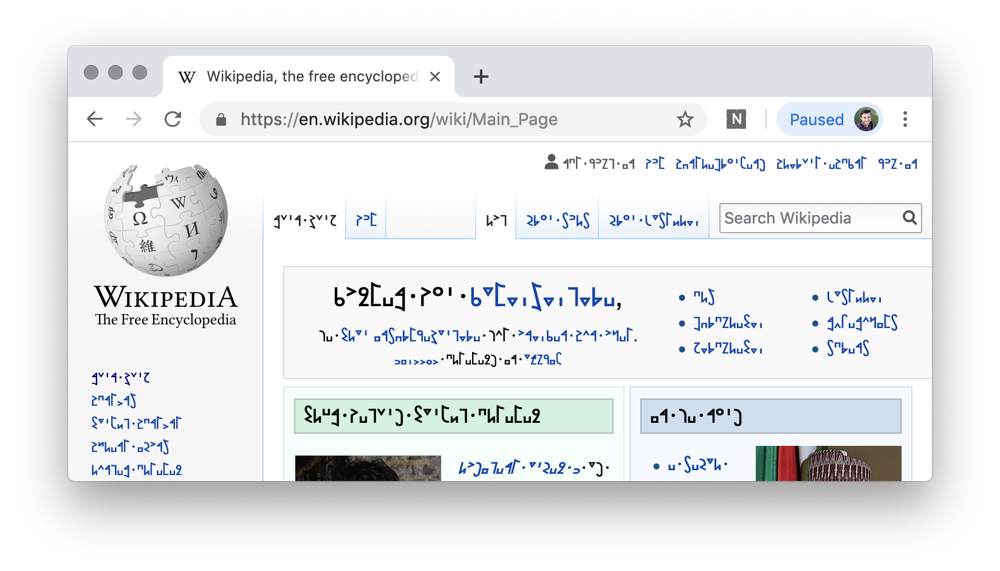

# Neoscripts browser extension

Automatically transcribe web pages into a constructed alphabet.

<table>
  <tr>
    <td rowspan="3">English (US)</td>
    <td>✅ Shwa Script</td>
  </tr>
  <tr>
    <td>🕓 ARPAbet</td>
  </tr>
  <tr>
    <td>🕓 Shavian</td>
  </tr>
</table>

Supports Chrome, Firefox, Edge, Opera, and Vivaldi.

## Install for testing

1. Clone or download this repository.
2. Open your browser and go to the extensions page URL:
    - Chrome - `chrome:extensions`
    - Firefox - `about:debugging#addons`
    - Edge - `about:flags`
    - Opera - `opera:extensions`
    - Vivaldi - `vivaldi:extensions`
3. Toggle "Developer Mode" on.
    - Or in Firefox, "Enable add-on debugging".
    - Or in Edge, "Enable extension developer features".
4. Click "Load Unpacked".
    - Or in Firefox, "Load Temporary Add-on...".
    - Or in Edge:
        - Click the `...` "More" menu.
        - Select "Extensions" from the menu.
        - Click the "Load extension" button.
5. Select the `manifest.json` file of this project. It's in `neoscripts-extension/Extension`.
6. Open a new webpage. Voilà!

If you make changes to the code, go back to the extensions page and click the reload button.
